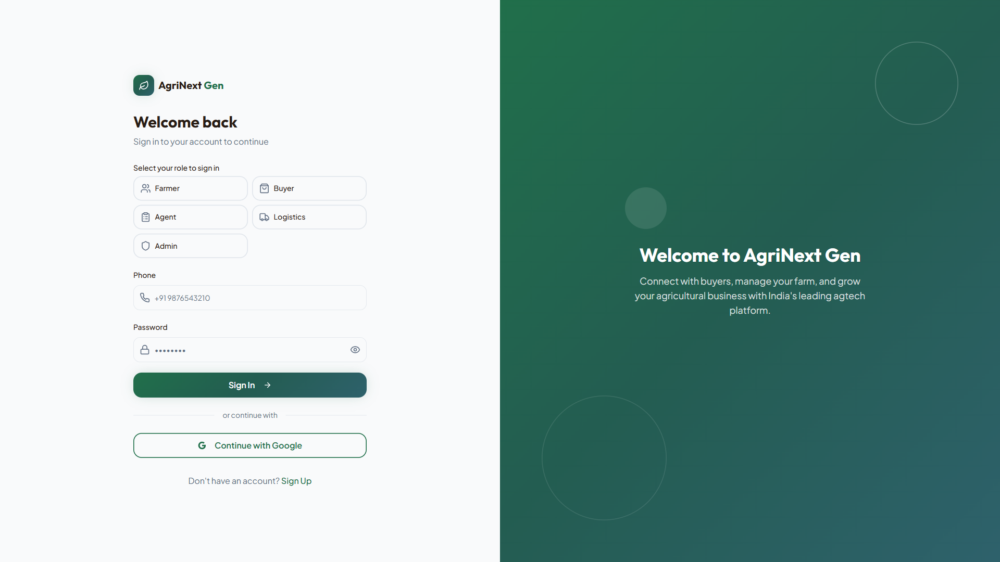
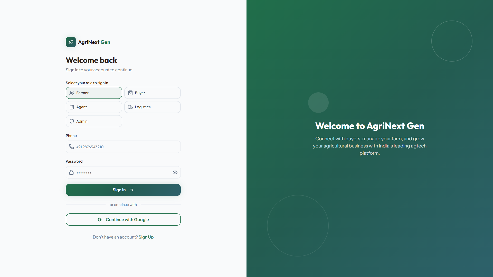
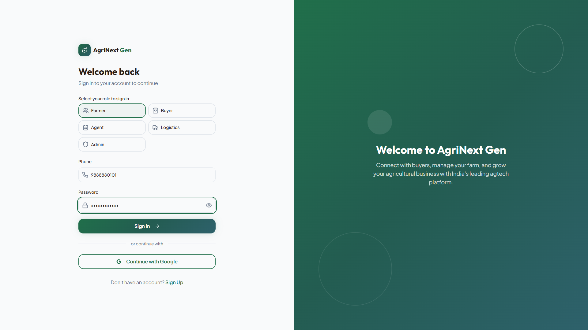
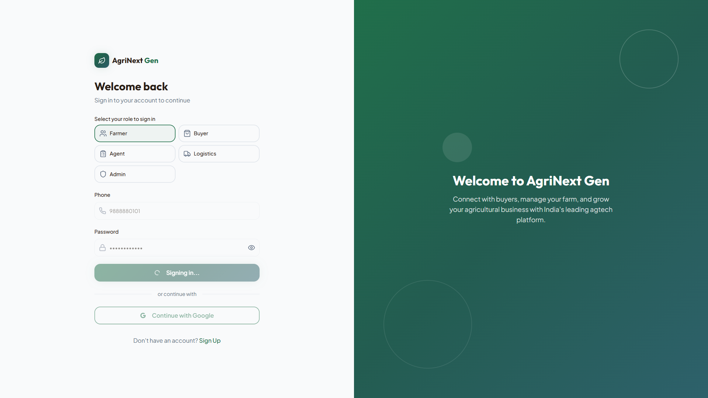

# AgriNext Farmer Dashboard UX Audit - INCOMPLETE (Auth Blocked)

**Date:** 2026-03-14  
**Target:** http://localhost:5173  
**Status:** ❌ **BLOCKED** - Authentication Edge Function not responding  
**Progress:** Login page captured, farmer dashboard pages not accessible

---

## ⚠️ Critical Blocker: Authentication Failure

### Issue Summary

The authentication system is non-functional, preventing access to any farmer dashboard pages.

### Symptoms

1. **Login button enters infinite loading state** - "Signing in..." spinner never completes
2. **No error messages displayed** to user (silent failure)
3. **Edge Function timeout** - `login-by-phone` Edge Function not responding
4. **No network errors** - The fetch call is made but never resolves

### Technical Details

```
Endpoint: https://rmtkkzfzdmpjlqexrbme.supabase.co/functions/v1/login-by-phone
Method: POST
Payload: { phone: "9888880101", password: "SmokeTest@99", role: "farmer" }
Result: Request hangs indefinitely
```

### Root Cause (Suspected)

The Edge Function `login-by-phone` is either:
1. **Not deployed** to the remote Supabase instance (rmtkkzfzdmpjlqexrbme.supabase.co)
2. **Misconfigured** (missing environment variables, database connection issues)
3. **Timing out** due to backend issues

### Required Fix

Before this UX audit can continue:

```bash
# Deploy Edge Functions to remote Supabase instance
npx supabase functions deploy login-by-phone --project-ref rmtkkzfzdmpjlqexrbme

# Verify deployment
curl -X POST https://rmtkkzfzdmpjlqexrbme.supabase.co/functions/v1/login-by-phone \
  -H "Content-Type: application/json" \
  -d '{"phone":"9888880101","password":"SmokeTest@99","role":"farmer"}'
```

**OR** if using local development:

```bash
# Start local Supabase (requires Docker)
npx supabase start

# Update .env to use local instance
VITE_SUPABASE_URL=http://localhost:54321
VITE_SUPABASE_ANON_KEY=<local_anon_key>

# Restart dev server
npm run dev
```

---

## What Was Captured

### ✅ Login Page (Desktop 1920x1080)

Successfully captured 3 stages of the login flow:

#### 1. Initial Login Page


**Visual Quality:**
- ✅ Clean, professional split-screen layout
- ✅ Brand identity prominent (AgriNext Gen logo with green accent)
- ✅ Clear hierarchy: "Welcome back" heading → role selection → form
- ✅ Good contrast and readability
- ✅ Marketing content on right side with gradient background

**UX Observations:**
- **Role selection** requires explicit click before entering credentials (good - prevents wrong-role login)
- **Phone input** placeholder shows "+91 9876543210" format (clear expectation)
- **Password field** has show/hide toggle (standard UX)
- **Alternative auth** provided: "Continue with Google" (not functional, likely placeholder)
- **Sign-up link** at bottom: "Don't have an account? Sign Up"

**Potential Issues:**
- No visible error state captured (can't assess error UX)
- Unknown if form validation messages are shown
- Can't verify accessibility (ARIA labels, keyboard nav)

#### 2. Farmer Role Selected


**UX Observations:**
- ✅ Selected role (Farmer) shows visual feedback with checkmark
- ✅ Form fields remain accessible after role selection
- Clear visual state change confirms user's selection

#### 3. Credentials Filled


**UX Observations:**
- ✅ Password is masked (dots visible)
- ✅ Phone number displays as entered
- Form ready for submission

#### 4. Infinite Loading State (Bug)



**Critical UX Bug:**
- ❌ Button shows "Signing in..." spinner indefinitely
- ❌ No timeout message after 15+ seconds
- ❌ No way to cancel the operation
- ❌ User is stuck with no feedback
- ❌ No error message shown despite backend failure

**UX Impact: SEVERE**
- Users have no idea what's happening
- No way to retry or cancel
- Appears to be a frozen/broken application
- Violates core usability principle: "Keep users informed of system status"

**Recommended Fixes:**
1. Add 10-second timeout with user-friendly error
2. Show "retry" button after timeout
3. Disable form inputs during loading (prevent double-submit)
4. Add progress indication: "Contacting server..."
5. Provide "Cancel" button during authentication

---

## Screenshots Captured

```
screenshots/farmer-audit/
├── desktop-00-login-initial.png       ✅ Captured
├── desktop-01-login-farmer-selected.png ✅ Captured
├── desktop-02-login-filled.png        ✅ Captured
├── login-diagnostic.png               ✅ Captured (bug state)
├── debug-final.png                    ✅ Captured (timeout state)
└── error-screenshot.png               ✅ Captured (playwright timeout)
```

---

## Pages NOT Captured (Blocked by Auth)

All farmer dashboard pages are inaccessible without authentication:

❌ **Not captured:**
- `/farmer/dashboard` - Main dashboard overview
- `/farmer/crops` - Crop management
- `/farmer/farmlands` - Land parcels
- `/farmer/transport` - Transport requests
- `/farmer/listings` - Produce listings
- `/farmer/orders` - Market orders
- `/farmer/earnings` - Financial summary
- `/farmer/notifications` - Notifications inbox
- `/farmer/settings` - User settings

❌ **Mobile views:**
- Mobile dashboard (375x812)
- Mobile hamburger menu
- Mobile page layouts

---

## Console Logs Analysis

From browser console during login attempt:

```
[BROWSER] debug [vite] connecting...
[BROWSER] debug [vite] connected.
[API] 200 http://localhost:5173/src/integrations/supabase/client.ts
[API] 200 http://localhost:5173/node_modules/.vite/deps/@supabase_supabase-js.js?v=af9897e4
[BROWSER] info React DevTools reminder (normal)
[BROWSER] warning React Router Future Flag Warnings (normal, not blocking)
[BROWSER] error Failed to load resource: the server responded with a status of 404 (Not Found)
```

**Key Finding:**
- One 404 error detected (resource not specified in logs)
- No explicit auth errors logged
- Network request to Edge Function likely timeout (not shown in console logs)

**Additional noise:**
- Multiple Razorpay preload warnings (these are normal, not blocking)

---

## Login Component Code Review

From `src/pages/Login.tsx` (lines 149-188):

```typescript
const res = await fetch(`${supabaseUrl}/functions/v1/login-by-phone`, {
  method: "POST",
  headers: { "Content-Type": "application/json" },
  body: JSON.stringify({ phone: normalizedPhone, password, role: selectedRole }),
});

const data = await res.json().catch(() => ({}));

if (!res.ok) {
  // Error handling exists
  const message = getLoginErrorMessage(res.status, data, t("auth.invalid_credentials"));
  setError(message);
  toast({ title: t("auth.login_failed"), description: message, variant: "destructive" });
  return;
}
```

**Code Quality: GOOD**
- ✅ Error handling exists for HTTP errors
- ✅ Toast notifications for user feedback
- ✅ Lockout handling for rate limiting
- ✅ Proper token validation before session creation

**Missing:**
- ❌ **No timeout on fetch request** - this is the bug
- ❌ **No AbortController** to cancel long-running requests
- ❌ **No loading timeout** - user can wait forever

**Recommended Fix:**

```typescript
// Add timeout wrapper
const controller = new AbortController();
const timeout = setTimeout(() => controller.abort(), 10000); // 10 sec

try {
  const res = await fetch(`${supabaseUrl}/functions/v1/login-by-phone`, {
    method: "POST",
    headers: { "Content-Type": "application/json" },
    body: JSON.stringify({ phone: normalizedPhone, password, role: selectedRole }),
    signal: controller.signal
  });
  clearTimeout(timeout);
  
  // ... existing code ...
  
} catch (error) {
  clearTimeout(timeout);
  if (error.name === 'AbortError') {
    setError(t("auth.timeout"));
    toast({ 
      title: t("auth.login_failed"), 
      description: t("auth.timeout_message"), 
      variant: "destructive" 
    });
  }
  // ... handle other errors ...
}
```

---

## Environment Configuration

From `.env`:

```
VITE_SUPABASE_URL="https://rmtkkzfzdmpjlqexrbme.supabase.co"
VITE_SUPABASE_PROJECT_ID="rmtkkzfzdmpjlqexrbme"
VITE_DEV_TOOLS_ENABLED=false
```

**Status:**
- ✅ Remote Supabase instance configured (not local)
- ✅ Valid project ID format
- ⚠️ Dev tools disabled (prevents role switching workaround)

**Docker Status:**
- ❌ Docker not running (Supabase local unavailable)
- Remote instance must be working for auth to succeed

---

## Next Steps

### Immediate (Blocking)

1. **Deploy Edge Function** or fix remote Supabase backend
   ```bash
   npx supabase functions deploy login-by-phone
   ```

2. **Verify Edge Function** is responding:
   ```bash
   curl -X POST https://rmtkkzfzdmpjlqexrbme.supabase.co/functions/v1/login-by-phone \
     -H "Content-Type: application/json" \
     -d '{"phone":"9888880101","password":"SmokeTest@99","role":"farmer"}'
   ```

3. **Add fetch timeout** to Login.tsx (10-second max wait)

### After Auth is Fixed

1. Re-run the UX audit script:
   ```bash
   node farmer-ux-audit.mjs
   ```

2. Capture all farmer dashboard pages:
   - Dashboard overview
   - Crops management
   - Farmlands
   - Transport requests
   - Listings
   - Orders
   - Earnings
   - Notifications
   - Settings

3. Capture mobile views (375x812):
   - Dashboard
   - Hamburger menu
   - Key workflows

4. Assess:
   - Visual consistency
   - Empty states
   - Error states
   - Loading states
   - Mobile responsiveness
   - i18n coverage (English + Kannada)

---

## Automation Scripts Created

### 1. `farmer-ux-audit.mjs`
Full automated audit script (blocked by auth)

**Features:**
- Automated login flow
- Full-page screenshots
- Console log capture
- Viewport switching (desktop → mobile)
- Detailed page descriptions

**Usage:**
```bash
node farmer-ux-audit.mjs
```

### 2. `debug-login.mjs`
Simplified debug script for auth troubleshooting

**Features:**
- Visible browser (headless: false)
- Console/network logging
- 5-minute keep-alive for manual inspection
- Error screenshot capture

**Usage:**
```bash
node debug-login.mjs
```

---

## Summary

**Status:** 🔴 **Incomplete** - Authentication blocker prevents dashboard audit

**Captured:** 5 screenshots of login page states

**Blocked:** 9+ dashboard pages + mobile views

**Critical Bugs Found:**
1. ❌ Infinite loading state on auth failure (no timeout)
2. ❌ No user feedback during long auth wait
3. ❌ Edge Function not responding (backend issue)

**Estimated Completion Time:** ~15 minutes after auth is fixed

**Recommendation:** Fix auth backend OR enable local Supabase, then re-run audit script.

---

## Appendix: Test Credentials

```
Role: Farmer
Phone: 9888880101
Password: SmokeTest@99
```

These credentials are hardcoded in smoke test suite but may not exist in the remote database.

**Action Required:** Verify test user exists in `rmtkkzfzdmpjlqexrbme` project:

```sql
SELECT * FROM auth.users WHERE phone = '+919888880101';
SELECT * FROM profiles WHERE phone = '9888880101';
SELECT * FROM user_roles WHERE user_id IN (
  SELECT id FROM auth.users WHERE phone = '+919888880101'
);
```

If user doesn't exist, run:
```bash
# Provision dummy users script
node scripts/provision-dummy-users.mjs
```

---

**End of Incomplete Audit Report**

*This audit will be completed once authentication backend is operational.*
